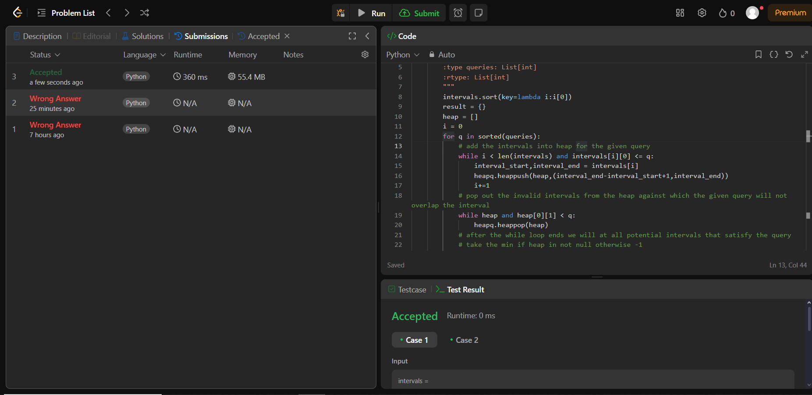

## 1851. Minimum Interval to Include Each Query

Dificuldade: Medium

[Link para a questão](https://leetcode.com/problems/minimum-interval-to-include-each-query/description/)

You are given a 2D integer array intervals, where intervals[i] = [lefti, righti] describes the ith interval starting at lefti and ending at righti (inclusive). The size of an interval is defined as the number of integers it contains, or more formally righti - lefti + 1.

You are also given an integer array queries. The answer to the jth query is the size of the smallest interval i such that lefti <= queries[j] <= righti. If no such interval exists, the answer is -1.

Return an array containing the answers to the queries.

Example 1:

Input: intervals = [[1,4],[2,4],[3,6],[4,4]], queries = [2,3,4,5]
Output: [3,3,1,4]
Explanation: The queries are processed as follows:
- Query = 2: The interval [2,4] is the smallest interval containing 2. The answer is 4 - 2 + 1 = 3.
- Query = 3: The interval [2,4] is the smallest interval containing 3. The answer is 4 - 2 + 1 = 3.
- Query = 4: The interval [4,4] is the smallest interval containing 4. The answer is 4 - 4 + 1 = 1.
- Query = 5: The interval [3,6] is the smallest interval containing 5. The answer is 6 - 3 + 1 = 4.

## Submissões:

