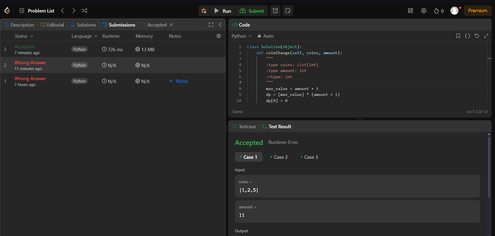
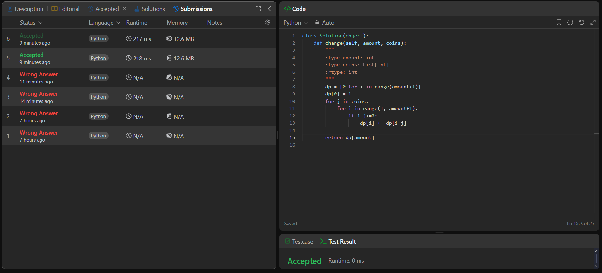
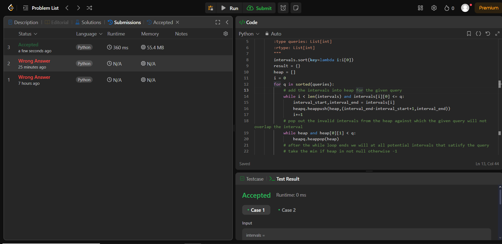
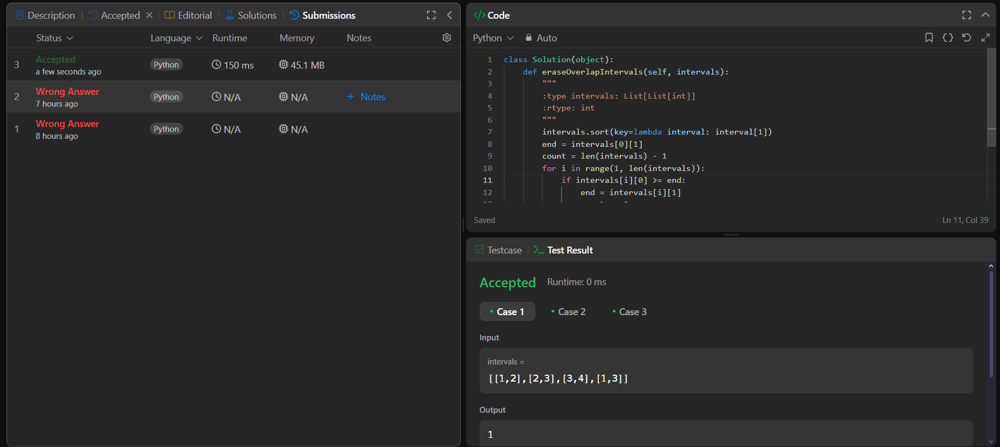

# AlgoritmosAmbiciosos-LeetCode_Problems

**Conteúdo da Disciplina**: Algoritmos Ambiciosos 

## Alunos
|Matrícula | Aluno |
| -- | -- |
| 20/0043030  |  Renann de Oliveira Gomes |

## Sobre 
Repos. inicial: https://github.com/projeto-de-algoritmos-2024/AlgoritmosAmbiciosos-LeetCode_Problems
Resolução de exercício do LeetCode, alguns exercício possuem scripts no final para poderem sr executados localmente sem a necessidade de testar no LeetCode

[Apresentação dos Problemas Resolvidos](https://youtu.be/-F1_wgeV-uw) 

## Screenshots

### 322. Coin Change

### 518. Coin Change II

## 1851. Minimum Interval to Include Each Query

## 435. Non-overlapping Intervals

## Instalação 
**Linguagem**: Python 

Python instalado localmente ou acesso a plataforma LeetCode

## Uso 
É possível executar o código localmente ou copiando apenas a classe "Solution" e rodar na plataforma do LeetCode

